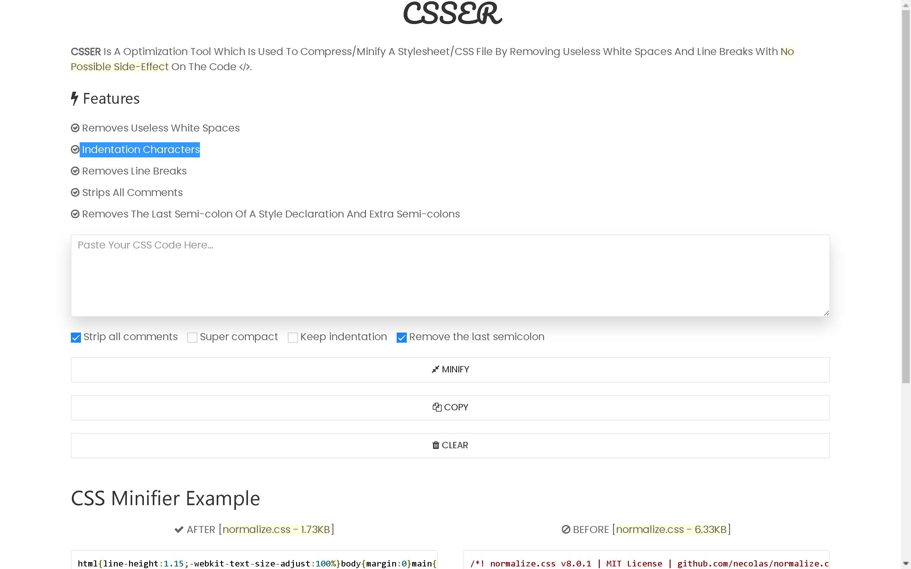

# CSSER &#187; CSS MINIFIER

CSSER Is A Optimization Tool Which Is Used To Compress/Minify A Stylesheet/CSS File By Removing Useless White Spaces And Line Breaks With No Possible Side-Effect On The Code.

Check Out The [PARSER](https://mandarnaik016.github.io/csser/index.html)!

### Show Some :heart:

## Website Screenshots

## Author & Support

This Project Was Created By [Mandar Naik](https://github.com/mandarnaik016)

If You Appreciate My Work, Consider [Buying Me](https://www.paypal.com/paypalme/MDnaik/5usd) a Cup Of :coffee: To Keep Me Recharged :muscle: [PayPal](https://www.paypal.com/paypalme/MDnaik/5usd).

# License

    Copyright 2020 Mandar Naik

    Licensed under the Apache License, Version 2.0 (the "License");
    you may not use this file except in compliance with the License.
    You may obtain a copy of the License at

       http://www.apache.org/licenses/LICENSE-2.0

    Unless required by applicable law or agreed to in writing, software
    distributed under the License is distributed on an "AS IS" BASIS,
    WITHOUT WARRANTIES OR CONDITIONS OF ANY KIND, either express or implied.
    See the License for the specific language governing permissions and
    limitations under the License.
